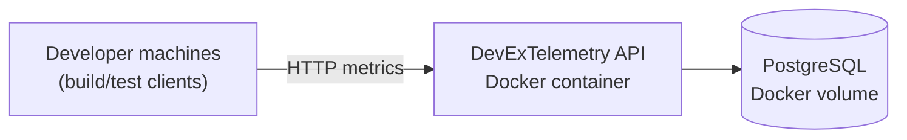
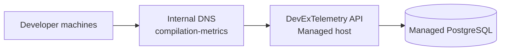
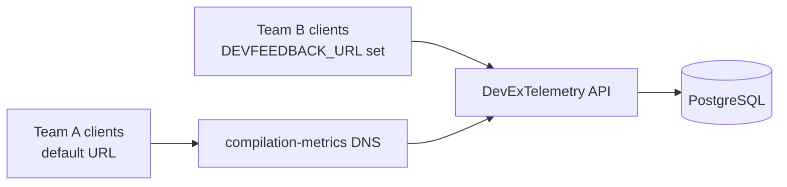

# Deployment Scenarios

This document shows common deployment patterns for Agoda.DevExTelemetry and how telemetry clients connect in each case.

## Scenario A: Single-host Docker Compose (small team / PoC)

- API and PostgreSQL run on one host.
- Clients point directly to host URL or internal DNS.



### Pros
- Fastest setup
- Minimal infra dependencies

### Cons
- Single host is a SPOF
- Limited scaling

---

## Scenario B: App Service / Managed host + managed PostgreSQL

- API runs on managed compute.
- PostgreSQL runs as managed DB.
- Clients use either internal DNS (`compilation-metrics`) or `DEVFEEDBACK_URL`.



### Pros
- Better uptime and managed operations
- Easier backups/patching

### Cons
- Needs DNS + infra coordination

---

## Scenario C: Mixed rollout (transition state)

- Some teams use DNS default.
- Some teams use workstation-level `DEVFEEDBACK_URL` override.



### Pros
- Incremental migration
- Lower rollout friction

### Cons
- Multiple connection patterns to support temporarily

---

## Client Routing Rules

Compilation/test clients route as follows:

1. If `DEVFEEDBACK_URL` is set, use it.
2. Otherwise, use default `http://compilation-metrics`.

Recommended enterprise pattern:
- Keep client defaults untouched.
- Control destination centrally with DNS.

---

## Example environment variables

### API host

```bash
export POSTGRES_CONNECTION_STRING='Host=postgres;Port=5432;Database=devex_telemetry;Username=devex;Password=devex'
```

### Client machine override (optional)

```bash
export DEVFEEDBACK_URL='https://your-devex-telemetry.example.com'
```

---

## Security notes

- Keep the API internal (VPN/private network/internal ingress).
- Do not expose PostgreSQL directly to the public internet.
- Use TLS for cross-network telemetry traffic.
