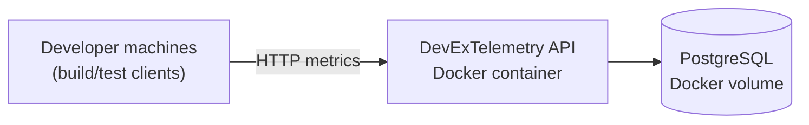
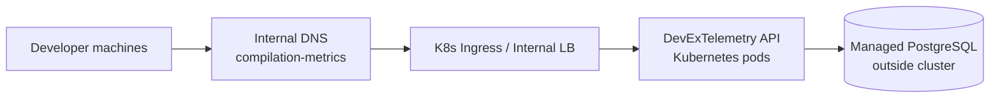
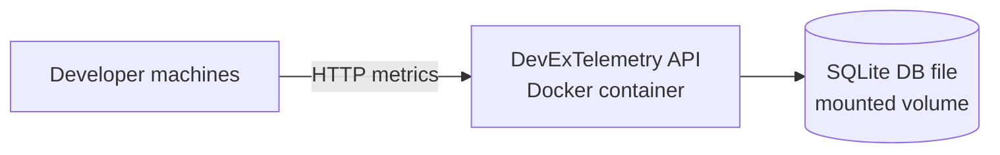

# Deployment Scenarios

This document shows common deployment patterns for Agoda.DevExTelemetry and how telemetry clients connect in each case.

## Scenario A: Single-host Docker Compose (small team / PoC)

- API and PostgreSQL run on one host.
- Good for quick validation and small-team internal usage.



### Example `docker-compose.yml`

```yaml
services:
  app:
    image: agoda/devex-telemetry:latest
    ports:
      - "8080:8080"
    environment:
      - POSTGRES_CONNECTION_STRING=Host=db;Port=5432;Database=devex_telemetry;Username=devex;Password=devex
    depends_on:
      - db

  db:
    image: postgres:17-alpine
    environment:
      POSTGRES_DB: devex_telemetry
      POSTGRES_USER: devex
      POSTGRES_PASSWORD: devex
    volumes:
      - pgdata:/var/lib/postgresql/data
    ports:
      - "5432:5432"

volumes:
  pgdata:
```

### Pros
- Fastest setup
- Minimal infra dependencies

### Cons
- Single host is a SPOF
- Limited scaling

---

## Scenario B: Kubernetes + Helm (app) with externally managed PostgreSQL

- App is deployed to Kubernetes via Helm.
- PostgreSQL is managed externally (Azure Database for PostgreSQL / RDS / Cloud SQL / internal managed DB).
- App receives DB connectivity via `POSTGRES_CONNECTION_STRING` in Helm values.



### Minimal Helm chart (app layer)

#### `Chart.yaml`

```yaml
apiVersion: v2
name: devex-telemetry
version: 0.1.0
appVersion: "latest"
```

#### `values.yaml`

```yaml
image:
  repository: agoda/devex-telemetry
  tag: latest
  pullPolicy: IfNotPresent

replicaCount: 2

service:
  type: ClusterIP
  port: 8080

ingress:
  enabled: true
  className: nginx
  host: devex-telemetry.internal.example.com

env:
  POSTGRES_CONNECTION_STRING: "Host=managed-pg.internal;Port=5432;Database=devex_telemetry;Username=devex;Password=***"
```

#### `templates/deployment.yaml` (env excerpt)

```yaml
env:
  - name: POSTGRES_CONNECTION_STRING
    value: {{ .Values.env.POSTGRES_CONNECTION_STRING | quote }}
```

### Pros
- Better scalability and operability
- Clean separation between app runtime and managed database

### Cons
- Requires Kubernetes + Helm + ingress setup
- Requires platform/DNS coordination

---

## Scenario C: SQLite-only Docker Compose (ultra-simple local setup)

- Runs only the app container.
- Uses SQLite file storage inside a mounted Docker volume.
- Best for solo usage, demos, and very small temporary setups.
- **For development and testing only — not for production use.**



### Example `docker-compose.yml`

```yaml
services:
  app:
    image: agoda/devex-telemetry:latest
    ports:
      - "8080:8080"
    volumes:
      - telemetry-data:/app/data

volumes:
  telemetry-data:
```

### Pros
- Simplest possible deployment
- No separate database service required

### Cons
- Not suitable for multi-instance scaling
- Lower durability/performance characteristics vs managed PostgreSQL


## Pointing Clients at Your Deployment

Compilation/test clients route as follows:

1. If `DEVFEEDBACK_URL` is set, use it.
2. Otherwise, use default `http://compilation-metrics`.

### Preferred enterprise pattern: DNS default host

Most corporate networks already use internal DNS for service discovery (for internal APIs, proxies, package mirrors, etc.).

Because clients default to `http://compilation-metrics`, your network/workstation team can create an internal DNS record for `compilation-metrics` pointing to your telemetry API endpoint (ingress/internal LB/service host).

Example (corporate internal DNS):
- You may already have internal domains like `yourcompany.local`.
- Teams might already access internal systems such as `sql01.yourcompany.local`.
- Add a DNS record like `compilation-metrics.yourcompany.local` (or a short host alias `compilation-metrics`) and map it to your telemetry endpoint.
- Once that DNS path exists, the default client URL can resolve and telemetry will flow with zero local setup.

Once this is in place:

- no per-developer setup is required,
- telemetry works out-of-the-box,
- rollout and changes stay centralized with infra/network teams.

If you don’t control DNS yet, use `DEVFEEDBACK_URL` as a temporary bridge.

### Workstation override (optional)

```bash
export DEVFEEDBACK_URL='https://your-devex-telemetry.example.com'
```

Your IT support team can also push this centrally with endpoint/device management tooling if needed.

---

## Security notes

- Keep the API internal (VPN/private network/internal ingress).
- Do not expose PostgreSQL directly to the public internet.
- Use TLS for cross-network telemetry traffic.
- Prefer secrets management (K8s secrets / vault / parameter store) over plaintext credentials in Helm values.
